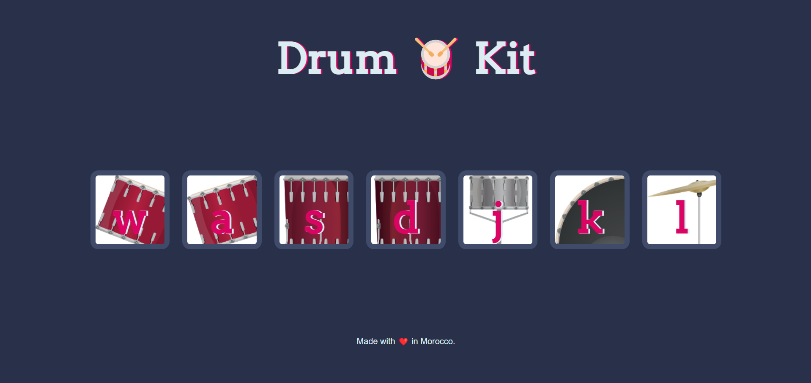

# 🥁 Drum Kit Web App

A fun and interactive **drum kit** built using **JavaScript**, **HTML**, and **CSS**.  
Click the drum buttons or press the corresponding keys on your keyboard to play drum sounds.  
Simple, responsive, and great for practicing event handling in JavaScript!

---

## 📸 Screenshot




---

## 🚀 Live Demo

👉 [Try it live here](https://hemdi2004.github.io/Drum-Kit/)  

---

## 🧰 Tech Stack

- **HTML** – For building the structure
- **CSS** – For styling and animations
- **JavaScript** – For sound control and interactivity

---

## 🔑 Features

- Press keys like `w`, `a`, `s`,`d`,`j`,`k`, `l` to trigger sounds
- Audio feedback for each key
- Responsive layout

---

## 📦 How to Run Locally

1. Clone this repository:
```bash
git clone https://github.com/yourusername/drum-kit.git
